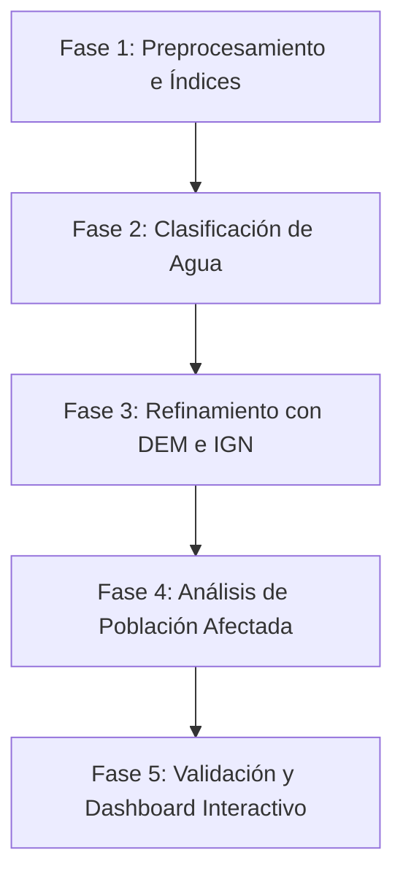

# Plan de Acción - Trabajo Práctico N° 2 (Teledetección)

Este documento detalla el plan de acción para caracterizar y cuantificar la inundación en Bahía Blanca (2025), estructurado en base a las consignas del TP, la propuesta de trabajo y el estado actual de los datos descargados.

---

## 🗂️ Diccionario de Archivos Actuales

A continuación se detalla el contenido y propósito de los archivos y directorios presentes en el espacio de trabajo.

### 1. Directorio: `data-Sentinel-2/`
Este directorio contiene copias de trabajo y archivos clave de referencia espacial:
*   **`AOI_20250219_20m_clip.tif`** (57.9 MB): Mosaico Sentinel-2 correspondiente al **19 de febrero de 2025** (antes o inicio del evento). Está recortado al polígono de interés (AOI), remuestreado a **20 metros de resolución** y guardado con compresión DEFLATE. Contiene las 7 bandas seleccionadas en el orden especificado abajo.
*   **`AOI_20250311_20m_clip.tif`** (60.2 MB): Mosaico Sentinel-2 correspondiente al **11 de marzo de 2025** (post-evento o pico). Mismo procesamiento, recorte y resolución de 20m.
*   **`aoi.geojson`** / **`aoi-tp2.geojson`** (481 B): Archivos de vectores geográficos que delimitan el Área de Interés (AOI) sobre Bahía Blanca, utilizados para recortar y delimitar los análisis espaciales.
*   **`TP Teledeteccion 2026.pdf`** (8.0 MB): Consigna original del trabajo práctico.

### 2. Directorio: `sentinel_descargas/`
Directorio de descarga cruda y procesamiento intermedio del script `Descarga de imágenes.ipynb`:
*   **`S2B_20HNB_*.tif`** y **`S2B_20HNC_*.tif`**: Archivos de bandas individuales (B02, B03, B04, B08 a 10m y B8A, B11, B12 a 20m) descargados para las cuadrículas Sentinel-2 `20HNB` y `20HNC` para las dos fechas bajo estudio.
*   **`AOI_20250219.tif`** y **`AOI_20250311.tif`** (~3.2 GB c/u): Mosaicos gigantes resultantes de unir las cuadrículas a su resolución original (sin recortar y sin compresión optimizada).
*   **`AOI_20250219_20m_clip.tif`** y **`AOI_20250311_20m_clip.tif`** (~57-60 MB c/u): Archivos optimizados listos para análisis (idénticos a los de `data-Sentinel-2/`).

> [!NOTE]
> **Orden de las bandas en los archivos `_20m_clip.tif`:**
> 1.  **Banda 1 (B04):** Rojo (Red) - 10m original
> 2.  **Banda 2 (B03):** Verde (Green) - 10m original
> 3.  **Banda 3 (B02):** Azul (Blue) - 10m original
> 4.  **Banda 4 (B8A):** NIR estrecho - 20m original
> 5.  **Banda 5 (B12):** SWIR 2 - 20m original
> 6.  **Banda 6 (B08):** NIR amplio - 10m original
> 7.  **Banda 7 (B11):** SWIR 1 - 20m original

---

## 📋 Plan de Acción Propuesto

El desarrollo del trabajo se estructurará en 5 fases secuenciales:

### Fase 1: Preprocesamiento y Cálculo de Índices Espectrales
*   **Objetivo:** Generar capas de índices especializados en la detección de agua para ambas fechas.
*   **Índices a calcular:**
    *   **NDWI (Normalized Difference Water Index):**
        $$\text{NDWI} = \frac{\text{Green} - \text{NIR}}{\text{Green} + \text{NIR}} = \frac{\text{B03} - \text{B08}}{\text{B03} + \text{B08}}$$
    *   **MNDWI (Modified Normalized Difference Water Index):** Excelente para zonas urbanas, ya que reduce la confusión con la edificación al usar SWIR:
        $$\text{MNDWI} = \frac{\text{Green} - \text{SWIR1}}{\text{Green} + \text{SWIR1}} = \frac{\text{B03} - \text{B11}}{\text{B03} + \text{B11}}$$

### Fase 2: Detección y Clasificación del Área Inundada (Machine Learning)
*   **Objetivo:** Clasificar las imágenes usando algoritmos de Machine Learning y calcular el área inundada en hectáreas.
*   **Estrategia:**
    1.  **Clasificación Semi-supervisada (Random Forest):** 
        *   Dado que no disponemos de un dataset de entrenamiento manual, utilizaremos los índices espectrales (NDWI y MNDWI) para seleccionar automáticamente píxeles de entrenamiento de "alta confianza":
            *   *Agua:* Pixeles con MNDWI > 0.35 y NDWI > 0.3.
            *   *No Agua/Tierra:* Pixeles con MNDWI < -0.1 y NDWI < 0.0.
        *   Entrenaremos un modelo de **Random Forest** (usando `scikit-learn`) con las 7 bandas espectrales utilizando estos píxeles de entrenamiento.
        *   Realizaremos la predicción sobre las dos fechas completas para obtener mapas temáticos robustos.
    2.  **Clasificación No Supervisada (K-Means):**
        *   Agruparemos los píxeles de las 7 bandas en $K$ clases (ej. $K=5$ o $K=6$) mediante **K-Means**.
        *   Identificaremos cuál de los clusters resultantes representa los cuerpos de agua / inundación y compararemos los resultados contra el modelo Random Forest.
    3.  **Detección de Cambios (Área Inundada):**
        *   Diferencia: $\text{Inundación} = \text{Agua}_{\text{Marzo}} - \text{Agua}_{\text{Febrero}}$.
        *   Cálculo del número de hectáreas afectadas dentro del polígono de referencia (`aoi.geojson`).

### Fase 3: Descarga e Integración de Datos de Elevación (DEM) y Filtrado
*   **Objetivo:** Evitar falsos positivos en zonas altas o laderas montañosas/urbanas usando la topografía.
*   **Tareas:**
    1.  Crear un script en Python que consulte la **API pública de OpenTopography** usando los límites espaciales del AOI para descargar de forma automática el **DEM SRTM de 30m** o **Copernicus 30m**.
    2.  Reproyectar el DEM obtenido al CRS de los GeoTIFFs de Sentinel-2 (UTM 20S) y remuestrearlo a 20 metros.
    3.  Calcular pendientes (Slope).
    4.  **Filtrar resultados de inundación:** Descartar píxeles inundados falsos si la elevación o pendiente está por encima de un umbral físicamente imposible para una inundación pluvial/fluvial en la zona baja urbana de Bahía Blanca.

### Fase 4: Descarga de Población (WorldPop) y Análisis de Impacto
*   **Objetivo:** Calcular la cantidad de población afectada por la inundación.
*   **Tareas:**
    1.  Escribir un script que descargue la densidad poblacional de **WorldPop** para Argentina (100 metros de resolución) directamente del servidor oficial utilizando `requests`.
    2.  Recortar y alinear el raster de población al AOI de Bahía Blanca.
    3.  Superponer la máscara de inundación limpia (Fase 3) con el raster de población y sumar la población afectada para calcular métricas de impacto social.

### Fase 5: Validación y Dashboard Interactivo
*   **Objetivo:** Validar y presentar el proyecto de manera visual e interactiva.
*   **Tareas:**
    1.  **Descarga e Integración de Hidrología del IGN:** Descargar las capas vectoriales oficiales de espejos y líneas de agua de Bahía Blanca usando el servicio Web Feature Service (WFS) del IGN en Python (`geopandas`).
    2.  **Validación:** Comparar las máscaras del modelo de ML contra los cuerpos de agua oficiales del IGN y bases de datos externas como **WorldFloods v2** (Hugging Face).
    3.  **Creación del Dashboard:** Diseñar una interfaz interactiva con **Streamlit** que muestre:
        *   Un visor de mapas interactivo (Folium/Leafmap) con capas seleccionables (imagen satelital, máscara de inundación, DEM, WorldPop).
        *   Un panel con métricas clave (hectáreas inundadas totales, estimación de población afectada, comparación de algoritmos K-Means vs Random Forest).
        *   Comparadores de tipo cortina ("Split map") entre Febrero y Marzo 2025.

---

## 🛠️ Plan de Verificación

*   **Verificación de Dependencias:** El entorno virtual `.venv` ya está configurado con todos los paquetes necesarios instalados (`scikit-learn`, `geopandas`, `rasterio`, `matplotlib`, `shapely`, `jupyter`, `ipykernel`).
*   **Ejecución y Testeo:** Correremos scripts en Python paso a paso para verificar las conexiones de descarga y la viabilidad matemática de las clasificaciones.
*   **Generación de Walkthrough:** Se detallarán los resultados del procesamiento con estadísticas y capturas del visualizador interactivo.
